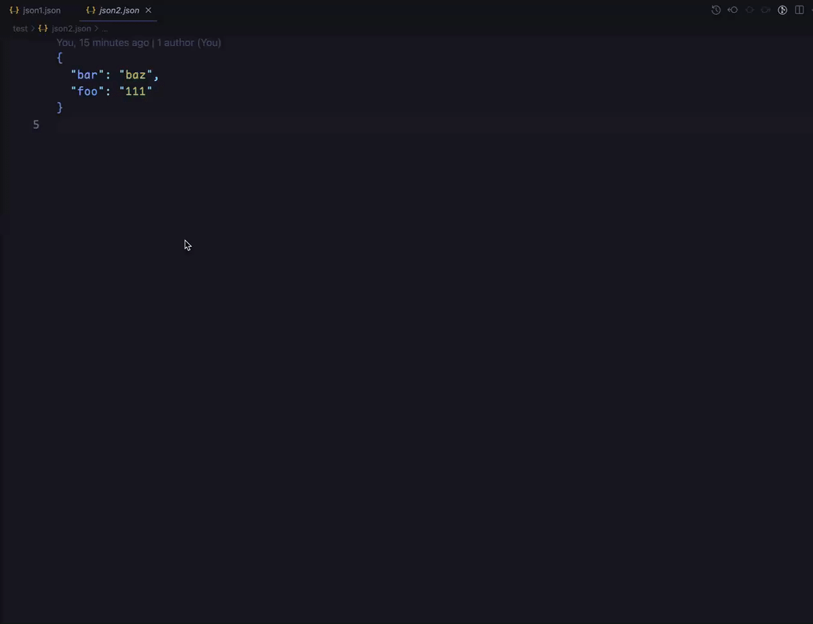

# json-missing-key

> This project is inspired by [json-key-diff](https://github.com/matseee/json-key-diff) but more modern and more beautiful.

This is a CLI to get missing keys between two json files.

## Usage

```bash
# first install it globally
p i -g json-missing-key

# then see help info
json-missing-key --help

# apply diffs
json-missing-key ./a.json ./b.json --apply=all
```

## Screenshot


